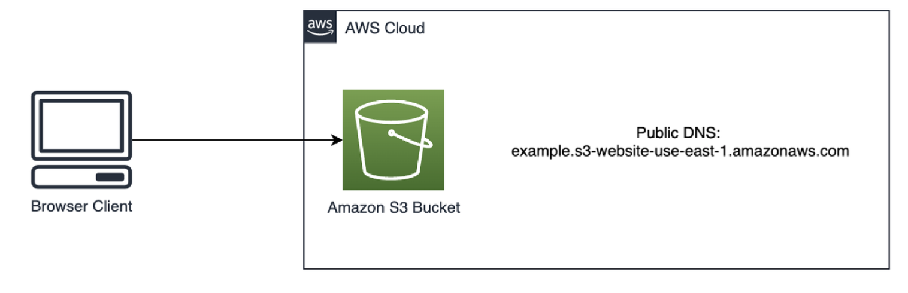

# Welcome to your Static Web Hosting on S3 Project!

This is a project for deploying a S3 bucket with web hosting enabled and a simple HTML page.

 


We'll be using [CDK](https://docs.aws.amazon.com/cdk/latest/guide/home.html) for creating our infrastructure.


This project is set up like a standard Python project.  The initialization
process also creates a virtualenv within this project, stored under the `.venv`
directory.  To create the virtualenv it assumes that there is a `python3`
(or `python` for Windows) executable in your path with access to the `venv`
package. If for any reason the automatic creation of the virtualenv fails,
you can create the virtualenv manually.

To manually create a virtualenv on MacOS and Linux:

```
$ python3 -m venv .venv
```

After the init process completes and the virtualenv is created, you can use the following
step to activate your virtualenv.

```
$ source .venv/bin/activate
```

If you are a Windows platform, you would activate the virtualenv like this:

```
% .venv\Scripts\activate.bat
```

Once the virtualenv is activated, you can install the required dependencies.

```
$ pip install -r requirements.txt
```

Prior to deploying, we need to bootstrap CDK

```
$cdk bootstrap
```

At this point you can now synthesize the CloudFormation template for this code.

```
$cdk synth
```

And we're ready to deploy!

```
$cdk deploy
```

Pay attention to the Output of this command as this will tell you the URL of your new website.

The URL should be next to ```s3-static-hosting.S3bucketwebsiteurl```

## Last comments ##
Once the deployment is done, you can open your AWS Console and navigate to S3.
You'll see two buckets created:
"s3-static-hosting-myhostingbucketXYZ" and "cdktooljit-stagingbucket-XYZ" (XYZ is just a placeholder, you'll see you get a random string)

Our website is hosted in the bucket with the name "s3-static-hosting-myhostingbucketXYZ". If you want to modify the initial HTML or add more assets, you'll have to do that in the [website-dist](https://github.com/gmansilla/s3-static-hosting/tree/main/website-dist) directory

The other bucket does not have public access and it's used by cdk to perform the deployment of the web assets. You shouldn't need to interact with this bucket.

## Destroying the stack ##

After you experiment with this project, you should delete the contents of your buckets (and any versions of objects) and run ```$cdk destroy```
Note: this command will attempt to destroy all components created and can fail if you still have objects in your buckets.

Enjoy!
